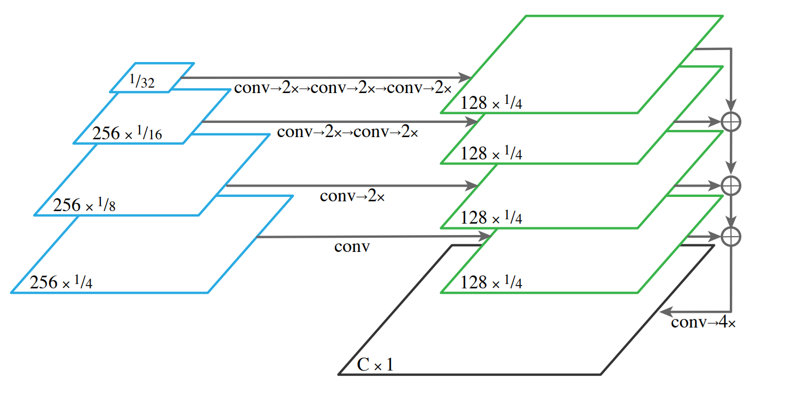

# Panopic-Feature-Pyramid-Network
**This project is the Pytorch implementation of this paper: [Panoptic Feature Pyramid Networks](https://openaccess.thecvf.com/content_CVPR_2019/papers/Kirillov_Panoptic_Feature_Pyramid_Networks_CVPR_2019_paper.pdf)**

## Data Prepration:
* [coco_instance_dataset.ipynb](DataLoaders/coco_instance_dataset.ipynb): Loading the COCO images and preparing their instance segmentation masks.
* [coco_semantic_dataset.ipynb](DataLoaders/coco_semantic_dataset.ipynb): Loading the COCO images and preparing their semantic segmentation masks.

## Models:
* [instance_model.ipynb](models/instance_model.ipynb): implementation of a model for the instance segmentation task. In this project a MASK RCNN model with Resnet50 as backbone is customized to be suitable for the COCO dataset.
* [semantic_model.ipynb](models/semantic_model.ipynb): implementation of a model for the semantic segmentation task. Modified a MASK RCNN model with a Resnet50 FPN backbone according to the proposed model in the paper as follows:
* 

* [panoptic_model.ipynb](models/panoptic_model.ipynb): A single model, which is the combination of the methods implemeted in (instance_model.ipynb)[models/instance_model.ipynb] and (semantic_model.ipynb)[]models/semantic_model.ipynb for panoptic segmentation.

## Training:
* [train_instance.ipynb](training/train_instance.ipynb): trains the instance segmentation model.
* [train_semantic.ipynb](training/train_semantic.ipynb): trains the semantic segmentation model.
* [train_panoptic.ipynb](training/train_panoptic.ipynb): trains the panoptic segmentation model.

**To Do List:**
- [x] Train the instance segmentation model.
- [x]  Train the semantic segmentation model. 
- [x] Combine the results of instance segmentation and semantic segmentation to produce results.
- [ ] train the joint model.
